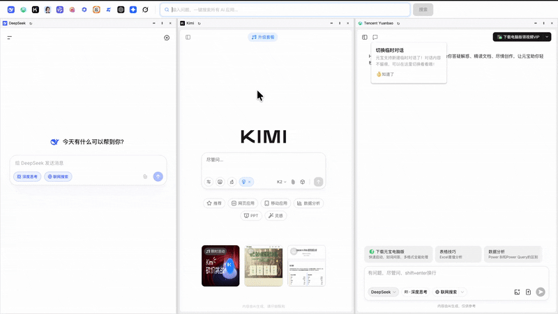

# ONE AI 🤖

> 一个 AI 聚合应用，提问一次，自动提交多个 AI 助手回答。

**为什么需要 ONE AI？**

在浏览器众多标签页中，找到你需要的 AI 应用跟他 chat ，这也太麻烦了！ ==> 你需要一个 AI 应用。cmd+tab 一键直达。

这个 AI 回答的不满意，怎么办？  ==> 用 ONE AI，一键提交多个 AI 助手对比回答。

这个应用使用很简单，实现也很简单，但足够实用。

我们在最后提供了开发指南，如果有你喜欢的应用我们没有支持，欢迎提 issue，或者PR 🙂

---

[](https://www.electronjs.org/) [](https://vuejs.org/) [](https://www.typescriptlang.org/) [](LICENSE)

## ✨ 特性

- 🚀 **多 AI 聚合** - 在一个应用内同时使用 DeepSeek、Yuanbao、Kimi、豆包、通义, ChatGPT, Gemini 等 12+ 个主流 AI
- 🔄 **一键分屏** - 支持横向/纵向分屏，可自由拖拽调整窗口大小
- 🎯 **一键搜索** - 在搜索框输入问题，一键发送到所有已打开的 AI 应用
- 💾 **会话持久化** - 使用独立 session，保持各 AI 应用的登录状态
- ⚡ **快速切换** - 点击顶部图标快速打开或切换不同的 AI 应用

## 📸 预览



## 🎯 支持的 AI 应用

| AI 应用 | 支持状态 | 官网 |
|--------|---------|------|
| ChatGPT | ✅ | https://chatgpt.com/ |
| DeepSeek | ✅ | https://chat.deepseek.com/ |
| Kimi (月之暗面) | ✅ | https://kimi.moonshot.cn/ |
| 豆包 | ✅ | https://www.doubao.com/chat/ |
| 通义千问 | ✅ | https://www.tongyi.com/ |
| 腾讯元宝 | ✅ | https://yuanbao.tencent.com/chat |
| 智谱清言 | ✅ | https://chatglm.cn/ |
| 百川智能 | ✅ | https://ying.baichuan-ai.com/chat |
| 阶跃星辰 | ✅ | https://stepfun.com |
| 海螺 AI | ✅ | https://chat.minimaxi.com/ |
| Gemini | ✅ | https://gemini.google.com/app |
| Grok | ✅ | https://grok.com |

## 🛠️ 技术栈

- **框架**: Electron + Vue 3 + TypeScript
- **UI 组件**: Naive UI
- **状态管理**: Pinia
- **样式**: SCSS + UnoCSS
- **构建工具**: Vite + electron-builder
- **包管理**: Yarn

## 📦 下载

> 💡 请前往 [Releases 页面](https://github.com/daozhonglee/one-ai/releases/latest) 下载最新版本

**macOS**
- [Apple Silicon (M1/M2/M3)](https://github.com/daozhonglee/one-ai/releases/download/v1.0.1/ONEAI-1.0.1-arm64.dmg)
- [Intel 芯片](https://github.com/daozhonglee/one-ai/releases/download/v1.0.1/ONEAI-1.0.1.dmg)
- [ZIP 格式 (Apple Silicon)](https://github.com/daozhonglee/one-ai/releases/download/v1.0.1/ONEAI-1.0.1-arm64-mac.zip)
- [ZIP 格式 (Intel)](https://github.com/daozhonglee/one-ai/releases/download/v1.0.1/ONEAI-1.0.1-mac.zip)

**Windows**
- [Windows 10/11 (支持 x64/ia32/arm64)](https://github.com/daozhonglee/one-ai/releases/download/v1.0.1/ONEAI%20Setup%201.0.1.exe)

## 🔧 开发

### 启动开发服务器

```bash
# 安装依赖
yarn

# 启动开发模式（会自动打开应用和 DevTools）
yarn dev
```

### 项目结构

```
one-ai/
├── electron/              # Electron 主进程
│   ├── main.ts           # 主进程入口
│   └── preload.ts        # 预加载脚本
├── src/                  # Vue 渲染进程
│   ├── assets/           # 静态资源（AI 应用图标）
│   │   ├── apps/        # AI 应用 logo
│   │   ├── models/      # AI 模型 logo
│   │   └── providers/   # AI 服务商 logo
│   ├── pages/           # 页面组件
│   │   └── Main/        # 主页面
│   │       ├── components/
│   │       │   ├── AppView.vue      # AI 应用视图（webview）
│   │       │   ├── SearchBar.vue    # 搜索栏
│   │       │   ├── SplitLayout.vue  # 分屏布局
│   │       │   └── const.js         # AI 应用列表配置
│   │       └── index.vue
│   ├── store/           # Pinia 状态管理
│   │   └── appStore.ts  # 应用状态（标签、布局、搜索）
│   ├── utils/           # 工具函数
│   ├── App.vue          # 根组件
│   ├── main.ts          # 入口文件
│   └── style.css        # 全局样式
├── public/              # 公共资源
│   └── *.icns/ico      # 应用图标
├── doc/                 # 文档
├── package.json         # 项目配置
└── vite.config.ts       # Vite 配置
```

### 添加新的 AI 应用

1. **准备应用图标**：将 logo 放入 `src/assets/apps/` 或 `src/assets/providers/`

2. **更新应用列表**：编辑 `src/pages/Main/components/const.js`

```javascript
export const AIAppList = [
  // ... 其他应用
  {
    id: "your-ai-id",           // 唯一标识
    name: "Your AI Name",       // 显示名称
    url: "https://your-ai.com", // 应用 URL
    logo: YourAILogo,           // 导入的 logo
    bodered: false,             // 是否需要边框
  },
];
```

3. **配置搜索选择器**（可选）：如果要支持一键搜索，在 `src/store/appStore.ts` 添加配置

```typescript
appSearchConfigs: new Map<string, AppSearchConfig>([
  // ... 其他配置
  [
    "your-ai-id",
    {
      inputSelector: "textarea, input[type='text']",  // 输入框选择器
      submitSelector: "button[type='submit']",        // 发送按钮选择器
      submitMethod: "click",                          // 提交方式：click 或 enter
    },
  ],
]),
```

### 调试

#### 主进程调试

开发模式下会自动打开 DevTools，可以查看主进程日志和渲染进程日志。

```bash
yarn dev
# DevTools 会自动弹出
```

#### WebView 调试

如果需要调试 AI 应用的 webview 内部：

1. 在 `src/pages/Main/components/AppView.vue` 的 `onMounted` 中已添加自动打开 DevTools 的逻辑
2. 打开对应的 AI 应用，DevTools 会自动弹出
3. 可以在 Console 查看注入脚本的执行日志
4. 可以在 Network 查看 API 请求

#### 清理缓存

如果遇到问题，可以清理开发环境缓存：

```bash
# 清理开发缓存
yarn cdev

# 清理发布缓存
yarn crelease
```

## 🐛 常见问题

### Q: macOS 提示"无法打开，因为无法验证开发者"？

**A:** 右键点击应用 → 选择"打开" → 在弹出的对话框中点击"打开"

或在终端执行：
```bash
xattr -cr /Applications/ONEAI.app
```

### Q: Windows Defender 报毒？

**A:** 这是误报，electron-builder 打包的应用常见问题。可以添加信任或从源码构建。

### Q: AI 应用无法登录或显示异常？

**A:** 
1. 尝试刷新页面（点击刷新按钮）
2. 检查网络连接
3. 某些 AI 可能需要在浏览器中先登录一次

### Q: 搜索功能不工作？

**A:**
1. 确保已打开对应的 AI 应用
2. 某些 AI 的页面结构可能变化，需要更新选择器配置
3. 查看控制台日志了解具体错误

### Q: 应用占用内存过大？

**A:** 这是 Electron 应用的通病，每个 webview 都相当于一个独立浏览器。建议：
- 不要同时打开过多 AI 应用
- 关闭不使用的分屏
- 定期重启应用

## 🔒 安全说明

- 应用使用独立的 session 存储各 AI 的登录信息
- 开发模式下禁用了部分安全限制以支持跨域请求（仅影响 webview）
- 建议只在信任的网络环境下使用
- 不会收集或上传任何用户数据

---

**[⬆ 回到顶部](#one-ai-)**
